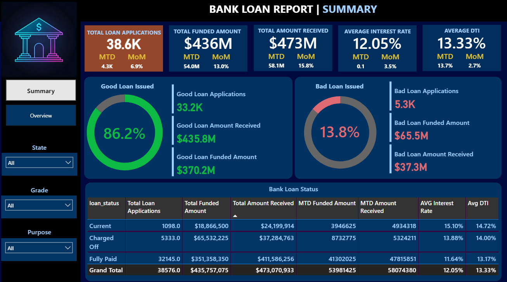
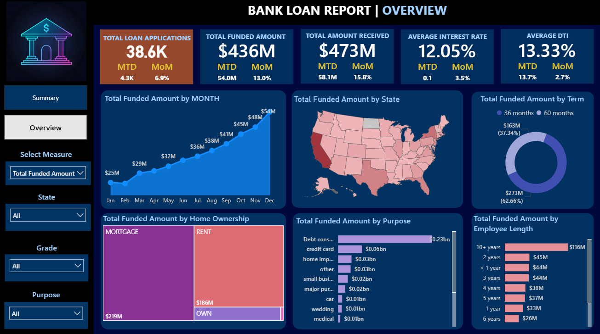

# 📊 Bank Loan Report Dashboard (Power BI)

## 📌 Overview
This project is a **Bank Loan Report Dashboard** built in **Power BI** to analyze loan application trends, funding amounts, and borrower characteristics.  
The dashboard helps banks and financial institutions **track loan performance, assess risk, and improve decision-making** by providing interactive and visual insights.  

---

## 🚨 Problem Statement
Banks process thousands of loan applications every month.  
Without a robust analytics system:
- It becomes challenging to **track total applications, loan status, and repayment trends**.
- Identifying **high-risk borrowers** and optimizing approval strategies becomes difficult.
- Decision-makers may lack **real-time insights** into lending patterns and performance metrics.

---

## 🎯 Objectives
- **Track** total loan applications and their statuses (Good Loans vs Bad Loans).
- **Analyze** loan performance over time, across states, purposes, and customer profiles.
- **Identify** trends in funding, repayment, and interest rates.
- **Enable** management to make **data-driven lending decisions**.

---

## 🔍 Key Insights from Dashboard
- **Total Loan Applications**: 38.6K applications in the dataset.
- **Funding Growth**: Clear upward trend in loan funding amounts month-over-month.
- **Loan Status Breakdown**:  
  - Good Loans: 86.2% (33.2K applications)  
  - Bad Loans: 13.8% (5.3K applications)
- **Purpose & Ownership Impact**: Mortgage loans and debt consolidation dominate the portfolio.
- **State-Level Insights**: Geographic variation in funded amounts highlights regional demand.

---

## 🛠 Features
1. **Interactive KPI Cards** for quick metrics (Applications, Funded Amount, Interest Rates).
2. **Monthly Trend Analysis** for funded amounts.
3. **Geographical Analysis** of loan amounts by U.S. states.
4. **Purpose & Ownership Segmentation** to understand borrower needs.
5. **Loan Term Comparison** for 36 vs 60 months.
6. **Employee Length Analysis** to identify stable vs risky borrower profiles.
7. **Dynamic Filters** for State, Grade, and Loan Purpose.

---

## 📷 Dashboard Screenshots

### Overview Page

--- 

---

## 📌 Tools & Technologies Used
- **Power BI** for data visualization
- **Power Query** for calculated measures and KPIs
- **Excel/CSV** as data source
- **Data Modeling** for relationships and hierarchies

---

## 💡 How This Helps Banks
- **Risk Management**: Identify high-risk borrower segments early.
- **Performance Tracking**: Monitor monthly growth and repayment behavior.
- **Decision Support**: Allocate resources effectively based on loan performance.
- **Customer Insights**: Understand borrower demographics and loan purposes.

